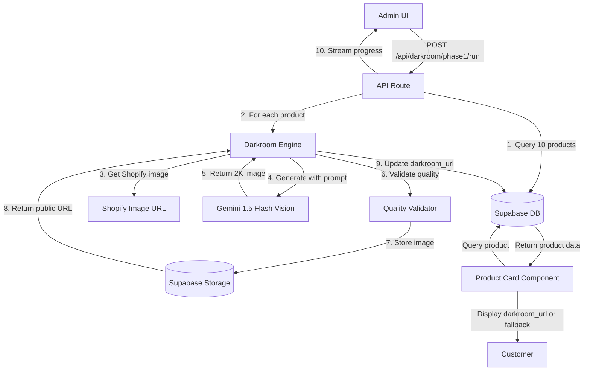

# Design Document: Darkroom Initiative Phase 1

## Overview

The Darkroom Initiative Phase 1 implements an AI-powered batch processing system that transforms supplier product images into brutalist architectural renders. The system processes 10 products from the Supabase database, generates 2K resolution images using Gemini 1.5 Flash Vision API with img2img transformation, stores results in Supabase Storage, and updates product records with the new image URLs. The frontend Product Card component implements smart fallback logic to display darkroom renders when available, falling back to original Shopify images.

This design leverages the existing Shopify Darkroom pipeline architecture (app/api/darkroom/run) as a reference pattern but adapts it for Supabase-based products with Gemini Vision API instead of background removal/compositing.

### Key Design Decisions

1. **Supabase-First Architecture**: Unlike the existing Shopify pipeline, this system operates entirely within Supabase for data and storage
2. **Gemini Vision API**: Uses img2img generation to preserve product shape while applying brutalist aesthetic
3. **Additive Schema**: Adds `darkroom_url` field to products table without disrupting existing image fields
4. **Smart Fallback Pattern**: Frontend prioritizes darkroom_url over existing image sources
5. **Streaming Progress**: Follows existing darkroom/run pattern with Server-Sent Events for real-time progress

## Architecture

### System Components



### Data Flow

1. **Batch Selection**: Query Supabase for 10 products (category: Candle Holders, ordered by ID)
2. **Sequential Processing**: For each product:
   - Inject product name into Style Seed Prompt
   - Call Gemini Vision API with prompt + Shopify image URL as img2img reference
   - Validate generated image (resolution, file size)
   - Store to Supabase Storage bucket "darkroom-renders"
   - Update product record with darkroom_url
3. **Progress Streaming**: Real-time updates via Server-Sent Events
4. **Frontend Display**: Product Card checks darkroom_url first, falls back to existing image sources

## Components and Interfaces

### 1. Darkroom Engine (`lib/darkroom/phase1-engine.ts`)

Core processing engine that orchestrates the batch generation pipeline.

```typescript
export interface Phase1Config {
  batchSize: number;          // Fixed at 10 for Phase 1
  category: string;           // "Candle Holders"
  retryAttempts: number;      // 1 retry on quality validation failure
}

export interface ProcessingResult {
  productId: string;
  productHandle: string;
  productTitle: string;
  status: 'success' | 'error';
  darkroomUrl?: string;
  processingTimeMs: number;
  error?: string;
}

export interface ProcessingProgress {
  total: number;
  processed: number;
  succeeded: number;
  failed: number;
  currentProduct?: string;
  averageTimeMs?: number;
}

export async function runPhase1Pipeline(
  onProgress?: (progress: ProcessingProgress) => void
): Promise<ProcessingResult[]>
```

### 2. Style Seed Prompt Template (`lib/darkroom/style-prompt.ts`)

Manages the brutalist aesthetic prompt template.

```typescript
export interface StylePromptConfig {
  productName: string;
}

export function getStyleSeedPrompt(config: StylePromptConfig): string {
  return `Architectural product photography of ${config.productName}. Brutalist aesthetic, monochromatic palette of charcoal, slate, and raw concrete. Sharp, dramatic chiaroscuro lighting casting deep, long shadows. The object is isolated on a rough stone plinth. High-fidelity 2K resolution. No props, minimalist environment. The object is the monument.`;
}
```

### 3. Image Generator (`lib/darkroom/gemini-generator.ts`)

Wrapper for Gemini 1.5 Flash Vision API img2img generation.

```typescript
export interface GenerationRequest {
  prompt: string;
  referenceImageUrl: string;  // Shopify image URL
  targetResolution: {
    width: number;              // 2048
    height: number;             // 2048
  };
}

export interface GenerationResult {
  imageBuffer: Buffer;
  mimeType: string;
  generatedAt: string;
}

export async function generateDarkroomImage(
  request: GenerationRequest
): Promise<GenerationResult>
```

### 4. Quality Validator (`lib/darkroom/quality-validator.ts`)

Validates generated images meet quality standards.

```typescript
export interface ValidationCriteria {
  expectedResolution: { width: number; height: number };
  minFileSizeKB: number;      // 100
  maxFileSizeMB: number;      // 5
}

export interface ValidationResult {
  valid: boolean;
  actualResolution?: { width: number; height: number };
  fileSizeKB?: number;
  errors: string[];
}

export async function validateImage(
  imageBuffer: Buffer,
  criteria: ValidationCriteria
): Promise<ValidationResult>
```

### 5. Storage Manager (`lib/darkroom/storage-manager.ts`)

Handles Supabase Storage operations for darkroom renders.

```typescript
export interface StorageConfig {
  bucket: string;             // "darkroom-renders"
  publicAccess: boolean;      // true
}

export interface StorageResult {
  publicUrl: string;
  storagePath: string;
  uploadedAt: string;
}

export async function storeDarkroomImage(
  imageBuffer: Buffer,
  productId: string,
  config: StorageConfig
): Promise<StorageResult>

export async function ensureBucketExists(
  bucketName: string,
  publicAccess: boolean
): Promise<void>
```

### 6. Database Manager (`lib/darkroom/database-manager.ts`)

Handles product queries and updates.

```typescript
export interface ProductForDarkroom {
  id: string;
  handle: string;
  title: string;
  category: string | null;
  image_url: string | null;
  images: Array<{ url: string; position: number }> | null;
  darkroom_url: string | null;
}

export async function fetchProductsForBatch(
  category: string,
  limit: number
): Promise<ProductForDarkroom[]>

export async function updateProductDarkroomUrl(
  productId: string,
  darkroomUrl: string
): Promise<void>
```

### 7. API Route (`app/api/darkroom/phase1/run/route.ts`)

Admin-only endpoint that executes the pipeline with streaming progress.

```typescript
export async function POST(request: NextRequest): Promise<Response> {
  // 1. Verify admin authentication
  // 2. Create Server-Sent Events stream
  // 3. Execute runPhase1Pipeline with progress callback
  // 4. Stream progress updates
  // 5. Return final results
}
```

### 8. Product Card Enhancement (`app/product/[handle]/ProductClient.tsx`)

Implements smart fallback logic for image display.

```typescript
// Existing component modification
const getProductImageUrl = (product: Product): string => {
  // Priority 1: Darkroom render
  if (product.darkroom_url) {
    return product.darkroom_url;
  }
  
  // Priority 2: Images array (existing)
  if (product.images && product.images.length > 0) {
    return product.images[0].url;
  }
  
  // Priority 3: Legacy image_url (existing)
  if (product.image_url) {
    return product.image_url;
  }
  
  // Priority 4: Placeholder
  return '/placeholder-product.jpg';
};
```

## Data Models

### Database Schema Changes

Add `darkroom_url` field to existing products table:

```sql
-- Migration: 009_add_darkroom_url.sql
ALTER TABLE products
  ADD COLUMN IF NOT EXISTS darkroom_url TEXT;

CREATE INDEX IF NOT EXISTS idx_products_darkroom_url 
  ON products(darkroom_url) 
  WHERE darkroom_url IS NOT NULL;

COMMENT ON COLUMN products.darkroom_url IS 
  'Public URL to AI-generated brutalist render from Darkroom Engine (Phase 1)';
```

### Updated Product Interface

```typescript
export interface Product {
  // ... existing fields ...
  darkroom_url?: string | null;  // NEW: AI-generated render URL
}
```

### Supabase Storage Structure

```
darkroom-renders/                    # Bucket (public read access)
├── {product_id}_{timestamp}.png     # Generated images
└── ...
```

Naming convention: `{product_id}_{timestamp}.png`
- Example: `550e8400-e29b-41d4-a716-446655440000_1704067200000.png`
- Timestamp: Unix milliseconds for uniqueness

## Error Handling

### Error Categories

1. **Database Errors**
   - No products found: Log warning, return empty results
   - Query failure: Log error, throw exception
   - Update failure: Log error, continue processing remaining products

2. **Image Generation Errors**
   - Invalid Shopify image URL: Log error, skip product
   - Gemini API failure: Log error, skip product
   - Timeout (>60s): Log error, skip product

3. **Quality Validation Errors**
   - Resolution mismatch: Log error, retry once
   - File size out of range: Log error, retry once
   - Retry exhausted: Log error, skip product

4. **Storage Errors**
   - Bucket creation failure: Log error, throw exception (fatal)
   - Upload failure: Log error, skip product
   - URL retrieval failure: Log error, skip product

### Error Logging Format

```typescript
interface ErrorLog {
  timestamp: string;          // ISO 8601
  level: 'error' | 'warning';
  productId?: string;
  productHandle?: string;
  errorType: string;          // e.g., "GEMINI_API_ERROR"
  message: string;
  stack?: string;
}
```

### Retry Strategy

- Quality validation failures: 1 retry
- All other errors: No retry (skip and continue)
- Rationale: Gemini API calls are expensive; validation failures may indicate transient issues

### Graceful Degradation

- Individual product failures do not halt the batch
- Progress continues with remaining products
- Final summary includes success/failure counts
- Admin can review logs and manually retry failed products


## Correctness Properties

A property is a characteristic or behavior that should hold true across all valid executions of a system—essentially, a formal statement about what the system should do. Properties serve as the bridge between human-readable specifications and machine-verifiable correctness guarantees.

### Property Reflection

After analyzing all acceptance criteria, I identified several areas of redundancy:

1. **Product name injection** (2.2 and 4.2): These test the same behavior - consolidated into Property 2
2. **Error recovery patterns** (4.4, 5.5, 6.4): All test "log and continue" - consolidated into Property 8
3. **Timing properties** (10.1, 10.2, 10.3): These are interdependent - consolidated into Property 14

The following properties represent the unique, non-redundant correctness guarantees for the system.

### Property 1: Product Query Ordering

For any set of products returned by the batch selection query, each product's ID should be lexicographically less than or equal to the next product's ID in the sequence.

**Validates: Requirements 1.3**

### Property 2: Product Name Injection

For any product with a non-empty title, the generated Style Seed Prompt should contain that exact product title in the position immediately following "Architectural product photography of ".

**Validates: Requirements 2.2, 4.2**

### Property 3: Prompt Template Consistency

For any two products processed in the same batch, the Style Seed Prompt structure (excluding the product name) should be identical when compared character-by-character.

**Validates: Requirements 2.3**

### Property 4: Image Generator Parameters

For any product processed, the Image Generator invocation should include both the Style Seed Prompt (containing the product name) and the Shopify image URL as parameters.

**Validates: Requirements 3.1, 4.3**

### Property 5: Generated Image Resolution

For any image generated by the Image Generator, the width and height dimensions should both equal 2048 pixels.

**Validates: Requirements 3.3, 9.1**

### Property 6: Batch Completeness

For any batch of N products selected for processing, the results array should contain exactly N entries (success or error), ensuring no products are silently dropped.

**Validates: Requirements 4.1**

### Property 7: Storage Filename Format

For any image stored in Darkroom Storage, the filename should match the pattern `{uuid}_{digits}.png` where uuid is a valid UUID format and digits represent a Unix timestamp in milliseconds.

**Validates: Requirements 5.2**

### Property 8: Error Recovery Continuation

For any product that encounters an error during generation, storage, or database update, the processing should continue to the next product without halting the entire batch.

**Validates: Requirements 4.4, 5.5, 6.4**

### Property 9: Storage URL Retrieval

For any image successfully stored in Darkroom Storage, the returned public URL should be non-empty and should contain the bucket name "darkroom-renders" in its path.

**Validates: Requirements 5.3**

### Property 10: Database Update Round-Trip

For any product successfully processed, querying the product record after update should return a darkroom_url field that equals the public URL returned from storage.

**Validates: Requirements 6.2**

### Property 11: Database Field Preservation

For any product record updated with darkroom_url, all other fields (id, handle, title, description, price, stock_quantity, category, image_url, images) should remain unchanged when compared before and after the update.

**Validates: Requirements 6.3**

### Property 12: Frontend Image Source Priority

For any product with a non-null darkroom_url field, the Product Card component should use darkroom_url as the image source, regardless of whether image_url or images array are also populated.

**Validates: Requirements 7.1**

### Property 13: Frontend Fallback Behavior

For any product with a null or empty darkroom_url field, the Product Card component should fall back to the next available image source (images array, then image_url, then placeholder).

**Validates: Requirements 7.2**

### Property 14: Processing Time Calculation

For any product processed, the logged processing time should equal the difference between the recorded end time and start time, measured in milliseconds and converted to seconds.

**Validates: Requirements 10.1, 10.2, 10.3**

### Property 15: Average Time Calculation

For any completed batch of N products, the logged average processing time should equal the sum of all individual processing times divided by N.

**Validates: Requirements 10.4**

### Property 16: Log Timestamp Format

For any log entry generated by the Darkroom Engine, the timestamp field should be parseable as a valid ISO 8601 datetime string.

**Validates: Requirements 8.5**

### Property 17: Error Log Structure

For any error that occurs during processing, the error log entry should contain at minimum: timestamp, product ID, error type, and error message fields.

**Validates: Requirements 8.3**

### Property 18: Image File Size Validation

For any generated image that passes quality validation, the file size should be greater than or equal to 100KB and less than or equal to 5MB.

**Validates: Requirements 9.2**

## Testing Strategy

### Dual Testing Approach

The testing strategy employs both unit tests and property-based tests to ensure comprehensive coverage:

- **Unit tests**: Verify specific examples, edge cases, and error conditions
- **Property tests**: Verify universal properties across randomized inputs

Both approaches are complementary and necessary. Unit tests catch concrete bugs in specific scenarios, while property tests verify general correctness across a wide input space.

### Property-Based Testing Configuration

**Library Selection**: 
- TypeScript/Node.js: Use `fast-check` library
- Rationale: Mature, well-maintained, excellent TypeScript support

**Test Configuration**:
- Minimum 100 iterations per property test (due to randomization)
- Each property test must include a comment tag referencing the design property
- Tag format: `// Feature: darkroom-phase-1, Property {number}: {property_text}`

**Example Property Test Structure**:

```typescript
import fc from 'fast-check';

// Feature: darkroom-phase-1, Property 2: Product Name Injection
test('Style Seed Prompt contains product name', () => {
  fc.assert(
    fc.property(
      fc.string({ minLength: 1, maxLength: 100 }), // Random product names
      (productName) => {
        const prompt = getStyleSeedPrompt({ productName });
        const expectedPrefix = `Architectural product photography of ${productName}`;
        expect(prompt.startsWith(expectedPrefix)).toBe(true);
      }
    ),
    { numRuns: 100 }
  );
});
```

### Unit Testing Focus Areas

Unit tests should focus on:

1. **Specific Examples**:
   - Batch selection returns exactly 10 products (1.1)
   - Batch selection filters by "Candle Holders" category (1.2)
   - Empty database triggers graceful termination (1.4)
   - Prompt template matches exact specification (2.1, 2.4)
   - Invalid Shopify URL triggers skip behavior (3.4)
   - Generation failure triggers continue behavior (4.4)
   - Completion summary includes success/failure counts (4.5)
   - Non-existent bucket triggers creation (5.4)
   - Storage failure triggers continue behavior (5.5)
   - Database update failure triggers continue behavior (6.4)
   - Both image sources fail triggers placeholder (7.4)
   - Processing start logs total product count (8.1)
   - Processing completion logs time and success rate (8.4)
   - Validation failure triggers retry (9.3)
   - Retry failure triggers skip (9.4)

2. **Integration Points**:
   - Gemini API integration with correct parameters
   - Supabase Storage bucket operations
   - Supabase Database query and update operations
   - Server-Sent Events streaming

3. **Edge Cases**:
   - Products with missing or null image URLs
   - Products with very long titles (>255 chars)
   - Storage bucket already exists
   - Concurrent processing requests (should be serialized)

### Property Testing Focus Areas

Property tests should verify the 18 correctness properties listed above, focusing on:

1. **Invariants**: Database field preservation (Property 11)
2. **Round-trip properties**: Database update round-trip (Property 10)
3. **Format validation**: Filename format (Property 7), timestamp format (Property 16)
4. **Calculation properties**: Processing time (Property 14), average time (Property 15)
5. **Universal behaviors**: Error recovery (Property 8), batch completeness (Property 6)

### Test Data Generation

For property-based tests, use these generators:

```typescript
// Product generator
const productArbitrary = fc.record({
  id: fc.uuid(),
  handle: fc.string({ minLength: 1, maxLength: 50 }),
  title: fc.string({ minLength: 1, maxLength: 100 }),
  category: fc.constantFrom('Candle Holders', 'Vases', 'Sculptures'),
  image_url: fc.webUrl(),
  price: fc.float({ min: 1, max: 1000 }),
  stock_quantity: fc.integer({ min: 0, max: 100 }),
});

// Image buffer generator (mock 2K image)
const imageBufferArbitrary = fc.uint8Array({ minLength: 102400, maxLength: 5242880 });

// Timestamp generator
const timestampArbitrary = fc.date().map(d => d.toISOString());
```

### Test Coverage Goals

- **Unit test coverage**: >80% line coverage for all darkroom-phase-1 modules
- **Property test coverage**: 100% of the 18 correctness properties
- **Integration test coverage**: All API endpoints and external service integrations
- **Error path coverage**: All error handling branches tested

### Continuous Integration

- Run all tests on every commit
- Property tests run with 100 iterations in CI
- Optionally run extended property tests (1000+ iterations) nightly
- Block merges if any test fails or coverage drops below threshold

