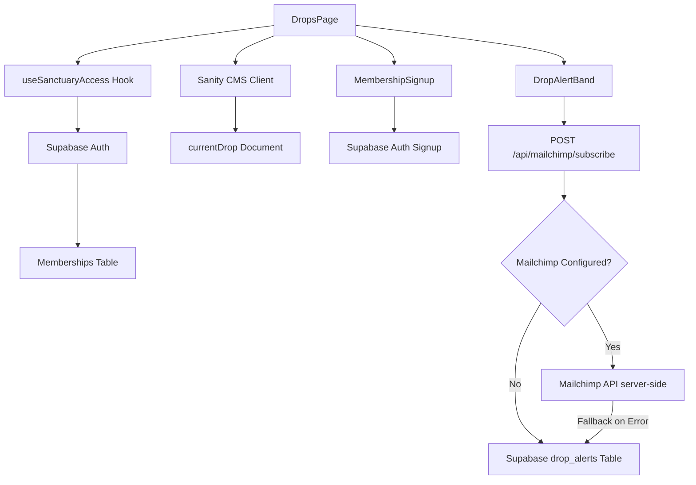

# Design Document: Drops Page

## Overview

The Drops page is a public-facing marketing page that showcases limited product releases for the Charmed & Dark brand. The page serves three primary audiences:

1. **Unauthenticated visitors** - Can view all content, sign up for drop alerts, and join the Sanctuary
2. **Authenticated non-members** - Same experience as unauthenticated visitors
3. **Sanctuary members** - Unlock the archive section and hide the sticky join bar

The page follows the established Sanctuary design system with dark backgrounds (#08080f), gold accents (#c9a96e), Cormorant Garamond serif headings, and Inter body text. The design emphasizes calm, quiet luxury with subtle animations and atmospheric visual elements (star fields, nebula gradients, crescent moons).

### Key Design Decisions

**Public-First Architecture**: Unlike the Sanctuary page which requires authentication, the Drops page is fully accessible to all visitors. This maximizes reach for marketing while still providing member-exclusive benefits (unlocked archive, early access information).

**Progressive Enhancement**: The page uses the `useSanctuaryAccess` hook to conditionally render member-only features without blocking the core experience. Non-members see locked archive cards with visual indicators, while members see unlocked content.

**CMS-Driven Scheduling**: Drop scheduling data is managed in Sanity CMS, allowing content managers to update drop information without code deployments. The page gracefully handles missing data with fallback values.

**Dual Email Capture**: The page supports both Mailchimp (for marketing automation) and Supabase (as a fallback) for drop alert subscriptions. Mailchimp API calls are handled server-side via a Next.js API route (`/api/mailchimp/subscribe`) to protect the secret API key — the client never calls Mailchimp directly.

## Architecture

### Component Hierarchy

```
DropsPage (app/drops/page.js)
├── DropsHero
│   ├── Star field background
│   ├── Nebula gradient overlay
│   ├── Crescent moon SVG
│   └── CTA buttons (scroll handlers)
├── NextDrop
│   ├── Sanity CMS data fetch
│   └── Status strip (3 columns)
├── MembershipBenefits
│   ├── Benefit cards (3)
│   └── MembershipSignup
│       └── Supabase auth integration
├── DropAlertBand
│   └── Email submission (Mailchimp/Supabase)
├── DropsArchive
│   ├── useSanctuaryAccess hook
│   └── Archive cards (3, conditionally locked)
└── DropsStickBar
    └── useSanctuaryAccess hook (conditional render)
```

### Data Flow



### External Dependencies

1. **Sanity CMS** - Content management for drop scheduling
   - Client library: `@sanity/client`
   - Query language: GROQ
   - Schema: `currentDrop` document type

2. **Supabase** - Authentication and database
   - Client library: `@supabase/supabase-js`
   - Tables: `memberships`, `drop_alerts`, `discount_codes`, `grimoire_entries`
   - Auth: Email/password authentication

3. **Mailchimp** (Optional) - Email marketing
   - API: Mailchimp Marketing API v3
   - List management: Drop alerts audience
   - Fallback: Supabase `drop_alerts` table

4. **Next.js** - React framework
   - App Router (client component)
   - Font optimization: `next/font/google`

## Components and Interfaces

### DropsPage Component

**File**: `app/drops/page.js`

**Type**: Client Component (`"use client"`)

**Responsibilities**:
- Render all child sections in sequence
- Apply page-level background color (#08080f)
- Handle scroll behavior for CTA buttons
- Manage page-level state (if needed)

**Props**: None (page component)

**State**:
- None required at page level (state managed in child components)

**Example Structure**:
```javascript
"use client";

export default function DropsPage() {
  const handleScrollToSection = (sectionId) => {
    const element = document.getElementById(sectionId);
    if (element) {
      element.scrollIntoView({ behavior: 'smooth' });
    }
  };

  return (
    <div style={{ backgroundColor: '#08080f' }}>
      <DropsHero onScrollToSignup={() => handleScrollToSection('membership-signup')} 
                 onScrollToAlerts={() => handleScrollToSection('drop-alerts')} />
      <div className="mx-auto max-w-7xl space-y-16 px-6 py-16">
        <NextDrop />
        <MembershipBenefits />
        <DropAlertBand />
        <DropsArchive />
      </div>
      <DropsStickBar onJoinClick={() => handleScrollToSection('membership-signup')} />
    </div>
  );
}
```

### DropsHero Component

**File**: `components/drops/DropsHero.js`

**Type**: Client Component

**Responsibilities**:
- Render hero section with atmospheric visuals
- Display eyebrow label, heading, subtext
- Render two CTA buttons with scroll handlers
- Display member benefit line

**Props**:
```typescript
interface DropsHeroProps {
  onScrollToSignup: () => void;
  onScrollToAlerts: () => void;
}
```

**Visual Elements**:
- Star field: 50 micro stars, random positions, 0.1-0.2 opacity
- Nebula gradient: Radial gradient at top right, 20% opacity
- Crescent moon: SVG in bottom-left, 8% opacity, partially cropped
- Buttons: Pill-shaped, gold border (#c9a96e) for primary, muted for secondary

**Styling**:
- Background: #08080f
- Eyebrow: 11px, uppercase, 0.3em letter-spacing, #c9a96e
- Heading: Cormorant Garamond, serif, large size
- Subtext: Inter, weight 300, #e8e4dc
- Member benefit line: 11px, uppercase, tracked, #c9a96e

### NextDrop Component

**File**: `components/drops/NextDrop.js`

**Type**: Client Component

**Responsibilities**:
- Fetch current drop data from Sanity CMS
- Display drop name or "Coming Soon" fallback
- Render three-column status strip with dates
- Apply pulse animation to connecting line

**Props**: None

**State**:
```typescript
interface NextDropState {
  dropName: string | null;
  previewDate: string | null;
  releaseDate: string | null;
  sanctuaryAccessDate: string | null;
  loading: boolean;
  error: Error | null;
}
```

**Sanity CMS Integration**:
```javascript
import { createClient } from '@sanity/client';

const sanityClient = createClient({
  projectId: process.env.NEXT_PUBLIC_SANITY_PROJECT_ID,
  dataset: process.env.NEXT_PUBLIC_SANITY_DATASET,
  apiVersion: '2024-01-01',
  useCdn: true,
});

// GROQ query
const query = `*[_type == "currentDrop"][0]{
  dropName,
  previewDate,
  releaseDate,
  sanctuaryAccessDate
}`;

// Fetch in useEffect
useEffect(() => {
  async function fetchDrop() {
    try {
      const data = await sanityClient.fetch(query);
      setDropData(data || {});
    } catch (error) {
      console.error('Failed to fetch drop data:', error);
      setDropData({});
    }
  }
  fetchDrop();
}, []);
```

**Date Formatting**:
```javascript
function formatDate(dateString) {
  if (!dateString) return 'TBA';
  const date = new Date(dateString);
  return date.toLocaleDateString('en-US', { 
    month: 'short', 
    day: 'numeric', 
    year: 'numeric' 
  });
}
```

**Status Strip Styling**:
- Background: #0e0e1a
- Top border: 2px solid #c9a96e
- Label: Uppercase, tracked, small size
- Value: Serif font, larger size
- Connecting line: 1px solid #c9a96e, pulse animation

### MembershipBenefits Component

**File**: `components/drops/MembershipBenefits.js`

**Type**: Client Component

**Responsibilities**:
- Display eyebrow, heading, subtext
- Render three benefit cards
- Render MembershipSignup block

**Props**: None

**Benefit Cards Data**:
```javascript
const benefits = [
  {
    title: "Always First",
    description: "Early access to every drop before the public window opens."
  },
  {
    title: "Always Less",
    description: "Sanctuary pricing on all drops—lower than public rates."
  },
  {
    title: "Always Yours",
    description: "Your readings saved in The Grimoire, your space preserved."
  }
];
```

### MembershipSignup Component

**File**: `components/drops/MembershipSignup.js`

**Type**: Client Component

**Responsibilities**:
- Render email input and submit button
- Handle Supabase auth user creation
- Display success/error messages
- Redirect to /sanctuary on success

**Props**: None

**State**:
```typescript
interface MembershipSignupState {
  email: string;
  loading: boolean;
  error: string | null;
  success: boolean;
}
```

**Supabase Integration**:
```javascript
import { supabase } from '@/lib/supabase/client';

async function handleSignup(email) {
  setLoading(true);
  setError(null);
  
  try {
    const { data, error } = await supabase.auth.signUp({
      email,
      password: generateTemporaryPassword(), // Or use magic link
      options: {
        emailRedirectTo: `${window.location.origin}/sanctuary`,
      },
    });
    
    if (error) throw error;
    
    setSuccess(true);
    // Redirect after short delay
    setTimeout(() => {
      window.location.href = '/sanctuary';
    }, 1500);
  } catch (error) {
    setError(error.message);
  } finally {
    setLoading(false);
  }
}
```

**Note**: The actual authentication flow may use magic links instead of passwords. This should be aligned with the existing Sanctuary authentication pattern.

### DropAlertBand Component

**File**: `components/drops/DropAlertBand.js`

**Type**: Client Component

**Responsibilities**:
- Render full-width band with gold borders
- Display label and subtext on left
- Render email input and button on right
- Handle email submission to Mailchimp or Supabase
- Display success/error messages

**Props**: None

**State**:
```typescript
interface DropAlertBandState {
  email: string;
  loading: boolean;
  error: string | null;
  success: boolean;
}
```

**Email Submission Logic**:
```javascript
async function handleSubmit(email) {
  setLoading(true);
  setError(null);
  
  // Validate email format
  if (!isValidEmail(email)) {
    setError('Please enter a valid email address');
    setLoading(false);
    return;
  }
  
  try {
    // Always POST to the server-side API route
    // The API route handles Mailchimp vs Supabase routing
    const response = await fetch('/api/mailchimp/subscribe', {
      method: 'POST',
      headers: { 'Content-Type': 'application/json' },
      body: JSON.stringify({ email }),
    });
    
    const result = await response.json();
    
    if (!response.ok) {
      throw new Error(result.error || 'Failed to subscribe');
    }
    
    setSuccess(true);
    setEmail('');
  } catch (error) {
    setError('Failed to subscribe. Please try again.');
  } finally {
    setLoading(false);
  }
}
```

### Mailchimp Subscribe API Route

**File**: `app/api/mailchimp/subscribe/route.js`

**Type**: Next.js API Route (server-side only)

**Responsibilities**:
- Receive email from client POST request
- Check if Mailchimp is configured (server-only env vars)
- If configured: call Mailchimp Marketing API v3 to add subscriber
- If not configured or Mailchimp fails: fall back to Supabase drop_alerts table
- Return success/error response to client

**Environment Variables** (server-only, no NEXT_PUBLIC_ prefix):
- `MAILCHIMP_API_KEY` — Mailchimp API secret key
- `MAILCHIMP_SERVER_PREFIX` — Mailchimp data center (e.g., `us1`)
- `MAILCHIMP_DROP_ALERTS_LIST_ID` — Audience/list ID for drop alerts

**Implementation**:
```javascript
import { NextResponse } from 'next/server';
import { createClient } from '@supabase/supabase-js';

export async function POST(request) {
  const { email } = await request.json();
  
  if (!email || !isValidEmail(email)) {
    return NextResponse.json({ error: 'Invalid email' }, { status: 400 });
  }
  
  const mailchimpKey = process.env.MAILCHIMP_API_KEY;
  const mailchimpServer = process.env.MAILCHIMP_SERVER_PREFIX;
  const mailchimpListId = process.env.MAILCHIMP_DROP_ALERTS_LIST_ID;
  
  // Try Mailchimp first if configured
  if (mailchimpKey && mailchimpServer && mailchimpListId) {
    try {
      const response = await fetch(
        `https://${mailchimpServer}.api.mailchimp.com/3.0/lists/${mailchimpListId}/members`,
        {
          method: 'POST',
          headers: {
            Authorization: `apikey ${mailchimpKey}`,
            'Content-Type': 'application/json',
          },
          body: JSON.stringify({
            email_address: email,
            status: 'subscribed',
            tags: ['drop-alerts'],
          }),
        }
      );
      
      if (response.ok || response.status === 400) {
        // 400 = already subscribed, treat as success
        return NextResponse.json({ success: true, provider: 'mailchimp' });
      }
      
      throw new Error('Mailchimp API error');
    } catch (error) {
      console.error('Mailchimp failed, falling back to Supabase:', error.message);
      // Fall through to Supabase
    }
  }
  
  // Supabase fallback
  try {
    const supabase = createClient(
      process.env.NEXT_PUBLIC_SUPABASE_URL,
      process.env.SUPABASE_SERVICE_ROLE_KEY || process.env.NEXT_PUBLIC_SUPABASE_ANON_KEY
    );
    
    const { error } = await supabase
      .from('drop_alerts')
      .insert({ email });
    
    if (error) {
      if (error.code === '23505') {
        // Duplicate email — treat as success
        return NextResponse.json({ success: true, provider: 'supabase' });
      }
      throw error;
    }
    
    return NextResponse.json({ success: true, provider: 'supabase' });
  } catch (error) {
    console.error('Supabase fallback failed:', error.message);
    return NextResponse.json({ error: 'Failed to subscribe' }, { status: 500 });
  }
}

function isValidEmail(email) {
  return /^[^\s@]+@[^\s@]+\.[^\s@]+$/.test(email);
}
```

**Styling**:
- Full-width band
- Border: 1px solid #c9a96e (top and bottom)
- Background: #0e0e1a or similar dark shade
- Responsive: Stack vertically on mobile

### DropsArchive Component

**File**: `components/drops/DropsArchive.js`

**Type**: Client Component

**Responsibilities**:
- Use useSanctuaryAccess hook to check membership
- Display "LOCKED" badge for non-members
- Render three archive cards
- Apply lock icons and blur for non-members
- Remove locks and reveal content for members

**Props**: None

**State**:
```typescript
// Uses useSanctuaryAccess hook
const { isMember, loading } = useSanctuaryAccess();
```

**Archive Cards Data**:
```javascript
const archiveCards = [
  { id: 'obsidian', title: 'OBSIDIAN ARCHIVE' },
  { id: 'eclipse', title: 'ECLIPSE VAULT' },
  { id: 'nocturne', title: 'NOCTURNE SHELF' }
];
```

**Conditional Rendering**:
```javascript
function ArchiveCard({ title, isLocked }) {
  return (
    <div className="relative" style={{ aspectRatio: '3/4' }}>
      <div 
        className="h-full"
        style={{
          backgroundColor: '#0e0e1a',
          border: '1px solid rgba(201, 169, 110, 0.15)',
        }}
      >
        <p className="p-4 text-xs uppercase tracking-[0.3em]" style={{ color: '#c9a96e' }}>
          {title}
        </p>
        
        {isLocked && (
          <>
            <div className="absolute inset-0 backdrop-blur-sm bg-black/40" />
            <div className="absolute inset-0 flex items-center justify-center">
              <LockIcon className="h-12 w-12" style={{ color: '#c9a96e' }} />
            </div>
          </>
        )}
        
        {!isLocked && (
          <div className="p-4">
            {/* Archive content goes here */}
            <p className="text-sm" style={{ color: '#e8e4dc' }}>
              Archive content for {title}
            </p>
          </div>
        )}
      </div>
    </div>
  );
}
```

**Hover Effect**:
```css
.archive-card:hover {
  box-shadow: 0 0 20px rgba(201, 169, 110, 0.2);
  transition: box-shadow 0.3s ease;
}
```

### DropsStickBar Component

**File**: `components/drops/DropsStickBar.js`

**Type**: Client Component

**Responsibilities**:
- Use useSanctuaryAccess hook to check membership
- Hide completely if user is a member
- Display persistent CTA for non-members
- Handle join button click (scroll or navigate)

**Props**:
```typescript
interface DropsStickBarProps {
  onJoinClick: () => void;
}
```

**Conditional Rendering**:
```javascript
export default function DropsStickBar({ onJoinClick }) {
  const { isMember } = useSanctuaryAccess();
  
  if (isMember) {
    return null;
  }
  
  return (
    <div
      className="fixed bottom-0 left-0 right-0 z-50 backdrop-blur"
      style={{
        backgroundColor: 'rgba(8,8,15,0.92)',
        borderTop: '1px solid #c9a96e',
      }}
    >
      <div className="mx-auto flex max-w-5xl items-center justify-between px-6 py-4">
        <p className="text-sm" style={{ color: '#e8e4dc' }}>
          JOIN FREE TO UNLOCK EARLY ACCESS AND SANCTUARY PRICING.
        </p>
        <button
          onClick={onJoinClick}
          className="rounded-full px-6 py-2 text-sm font-medium"
          style={{
            border: '1px solid #c9a96e',
            color: '#c9a96e',
          }}
        >
          JOIN FREE
        </button>
      </div>
    </div>
  );
}
```

## Data Models

### Sanity CMS Schema

**Document Type**: `currentDrop`

```javascript
export default {
  name: 'currentDrop',
  title: 'Current Drop',
  type: 'document',
  fields: [
    {
      name: 'dropName',
      title: 'Drop Name',
      type: 'string',
      description: 'Name of the current drop (e.g., "Midnight Ritual Collection")',
    },
    {
      name: 'previewDate',
      title: 'Preview Window Date',
      type: 'datetime',
      description: 'When the preview window opens',
    },
    {
      name: 'releaseDate',
      title: 'Release Window Date',
      type: 'datetime',
      description: 'When the public release window opens',
    },
    {
      name: 'sanctuaryAccessDate',
      title: 'Sanctuary Early Access Date',
      type: 'datetime',
      description: 'When Sanctuary members get early access',
    },
  ],
  preview: {
    select: {
      title: 'dropName',
      subtitle: 'releaseDate',
    },
  },
};
```

**Note**: Only one `currentDrop` document should exist at a time. The query uses `[0]` to get the first (and only) document.

### Supabase Tables

**Table**: `drop_alerts`

```sql
CREATE TABLE drop_alerts (
  id UUID PRIMARY KEY DEFAULT gen_random_uuid(),
  email TEXT NOT NULL UNIQUE,
  created_at TIMESTAMPTZ NOT NULL DEFAULT NOW()
);

-- Index for faster email lookups
CREATE INDEX idx_drop_alerts_email ON drop_alerts(email);

-- Index for sorting by creation date
CREATE INDEX idx_drop_alerts_created_at ON drop_alerts(created_at DESC);
```

**Table**: `memberships` (existing)

Referenced by `useSanctuaryAccess` hook. Schema:
```sql
CREATE TABLE memberships (
  id UUID PRIMARY KEY DEFAULT gen_random_uuid(),
  user_id UUID NOT NULL REFERENCES auth.users(id) ON DELETE CASCADE,
  status TEXT NOT NULL CHECK (status IN ('active', 'inactive', 'cancelled')),
  created_at TIMESTAMPTZ NOT NULL DEFAULT NOW(),
  updated_at TIMESTAMPTZ NOT NULL DEFAULT NOW()
);

CREATE INDEX idx_memberships_user_id ON memberships(user_id);
CREATE INDEX idx_memberships_status ON memberships(status);
```

### Environment Variables

```bash
# Sanity CMS
NEXT_PUBLIC_SANITY_PROJECT_ID=your_project_id
NEXT_PUBLIC_SANITY_DATASET=production

# Supabase
NEXT_PUBLIC_SUPABASE_URL=your_supabase_url
NEXT_PUBLIC_SUPABASE_ANON_KEY=your_anon_key

# Mailchimp (Optional, server-only — no NEXT_PUBLIC_ prefix)
MAILCHIMP_API_KEY=your_api_key
MAILCHIMP_SERVER_PREFIX=us1
MAILCHIMP_DROP_ALERTS_LIST_ID=your_list_id
```


## Correctness Properties

*A property is a characteristic or behavior that should hold true across all valid executions of a system—essentially, a formal statement about what the system should do. Properties serve as the bridge between human-readable specifications and machine-verifiable correctness guarantees.*

### Property 1: Design System Font Consistency for Headings

*For any* serif heading element on the Drops page, the computed font-family should be Cormorant Garamond.

**Validates: Requirements 1.3**

### Property 2: Design System Font Consistency for Body Text

*For any* body text element on the Drops page, the computed font-family should be Inter and font-weight should be 300.

**Validates: Requirements 1.4**

### Property 3: Design System Gold Accent Color Consistency

*For any* element designated as a gold accent (eyebrow labels, borders, buttons), the computed color should be #c9a96e.

**Validates: Requirements 1.5**

### Property 4: Design System Primary Text Color Consistency

*For any* element designated as primary text, the computed color should be #e8e4dc.

**Validates: Requirements 1.6**

### Property 5: Responsive Layout Without Overflow

*For any* viewport width (mobile, tablet, desktop), the page should render without horizontal scrollbar and all content should be visible within the viewport.

**Validates: Requirements 1.8**

### Property 6: Drop Name Display Based on CMS Data

*For any* response from Sanity CMS, if the response contains a dropName field, the NextDrop component should display that drop name; otherwise, it should display "Coming Soon".

**Validates: Requirements 3.3, 3.4**

### Property 7: Date Formatting Consistency

*For any* valid datetime value from Sanity CMS (previewDate, releaseDate, sanctuaryAccessDate), the formatted output should be a human-readable date string in the format "MMM DD, YYYY"; if the datetime value is null or undefined, the output should be "TBA".

**Validates: Requirements 3.7, 3.8, 3.9, 3.10, 3.11, 3.12, 4.4**

### Property 8: Graceful Degradation on CMS Query Failure

*For any* error or failure when querying Sanity CMS, the NextDrop component should display fallback values ("Coming Soon" for drop name and "TBA" for all dates) without throwing an error or crashing the page.

**Validates: Requirements 4.3**

### Property 9: Supabase Auth User Creation

*For any* valid email address submitted through the MembershipSignup form, the system should call the Supabase auth.signUp method with that email address.

**Validates: Requirements 6.6**

### Property 10: Redirect on Successful Signup

*For any* successful Supabase auth user creation, the system should redirect the user to the /sanctuary route.

**Validates: Requirements 6.7**

### Property 11: Error Message Display on Signup Failure

*For any* failed Supabase auth user creation, the MembershipSignup component should display an error message to the user.

**Validates: Requirements 6.8**

### Property 12: Email Routing Based on Mailchimp Configuration

*For any* email submitted through the DropAlertBand, if Mailchimp is configured (API key present), the system should attempt to submit to Mailchimp; if Mailchimp is not configured, the system should insert the email into the Supabase drop_alerts table.

**Validates: Requirements 7.6, 7.7, 12.4**

### Property 13: Success Message Display on Alert Submission

*For any* successful email submission (either Mailchimp or Supabase), the DropAlertBand component should display a success message to the user.

**Validates: Requirements 7.8**

### Property 14: Error Message Display on Alert Submission Failure

*For any* failed email submission, the DropAlertBand component should display an error message to the user.

**Validates: Requirements 7.9**

### Property 15: Email Format Validation

*For any* string submitted as an email through the DropAlertBand or MembershipSignup forms, the system should validate that the string matches a valid email format before attempting submission.

**Validates: Requirements 7.10**

### Property 16: Supabase Insertion for Drop Alerts

*For any* valid email address when Mailchimp is not configured, the system should insert a record into the drop_alerts table with the email and auto-generated id and created_at timestamp.

**Validates: Requirements 8.2**

### Property 17: Mailchimp Fallback on API Failure

*For any* Mailchimp API call that fails, the system should fall back to inserting the email into the Supabase drop_alerts table.

**Validates: Requirements 12.5**

### Property 18: Archive Visibility Based on Membership Status

*For any* user, if useSanctuaryAccess returns isMember as false, the DropsArchive component should display locked archive cards with lock icons and a "LOCKED" badge; if isMember is true, the component should remove lock icons, remove the "LOCKED" badge, and reveal archive content.

**Validates: Requirements 9.2, 9.8, 9.9, 9.10**

### Property 19: Stick Bar Visibility Based on Membership Status

*For any* user, if useSanctuaryAccess returns isMember as true, the DropsStickBar component should not render (return null); if isMember is false, the component should render the sticky bar with join CTA.

**Validates: Requirements 10.6, 10.7**

### Property 20: Public Access Without Authentication

*For any* unauthenticated visitor, the Drops page should render all sections (except unlocked archive content) without requiring authentication or redirecting away from the page.

**Validates: Requirements 11.2**

### Property 21: Visual Locking for Non-Members

*For any* non-member user, the DropsArchive component should apply visual locking effects (backdrop blur and lock icon overlay) to archive cards.

**Validates: Requirements 11.3**

## Error Handling

### Error Handling Strategy

The Drops page implements a graceful degradation strategy where external service failures do not prevent the page from rendering or functioning. All error states are handled with user-friendly fallbacks.

### Error Categories

**1. CMS Query Failures**
- **Scenario**: Sanity CMS is unreachable or returns an error
- **Handling**: Display fallback values ("Coming Soon", "TBA") without crashing
- **User Impact**: Minimal - users see placeholder content instead of dynamic data
- **Implementation**: Try-catch blocks around Sanity fetch calls with fallback state

**2. Authentication Failures**
- **Scenario**: Supabase auth.signUp fails (duplicate email, network error, etc.)
- **Handling**: Display error message to user, keep form accessible for retry
- **User Impact**: User sees error message and can retry with different email
- **Implementation**: Error state in component, display error message below form

**3. Email Submission Failures**
- **Scenario**: Mailchimp API fails or Supabase insert fails
- **Handling**: Display error message, attempt fallback to Supabase if Mailchimp fails
- **User Impact**: User sees error message and can retry
- **Implementation**: Try-catch with fallback logic, error state in component

**4. Hook Failures**
- **Scenario**: useSanctuaryAccess hook fails to fetch membership data
- **Handling**: Default to non-member state (show locked archive, show stick bar)
- **User Impact**: Members may temporarily see locked content until hook resolves
- **Implementation**: Default state in hook with loading flag

### Error Messages

All error messages should follow the Sanctuary design language:
- Calm, non-alarming tone
- Minimal technical jargon
- Clear next steps for the user

**Examples**:
- "Unable to join at this time. Please try again."
- "Could not subscribe to alerts. Please try again."
- "Unable to load drop information. Check back soon."

### Logging

All errors should be logged to the console for debugging:
```javascript
console.error('Drops page error:', {
  component: 'NextDrop',
  action: 'fetchDropData',
  error: error.message,
  timestamp: new Date().toISOString(),
});
```

## Testing Strategy

### Dual Testing Approach

The Drops page will be tested using both unit tests and property-based tests to ensure comprehensive coverage:

**Unit Tests**: Verify specific examples, edge cases, and error conditions
- Specific UI elements render correctly (hero text, buttons, cards)
- Specific user interactions work (button clicks, form submissions)
- Edge cases (empty CMS data, duplicate emails, network failures)
- Integration points (Sanity CMS, Supabase, Mailchimp)

**Property Tests**: Verify universal properties across all inputs
- Design system consistency (fonts, colors) across all elements
- Date formatting works for all valid datetime inputs
- Email validation works for all string inputs
- Conditional rendering works for all membership states
- Error handling works for all failure scenarios

### Property-Based Testing Configuration

**Library**: `fast-check` (JavaScript property-based testing library)

**Configuration**:
- Minimum 100 iterations per property test
- Each test tagged with feature name and property number
- Tag format: `Feature: drops-page, Property {number}: {property_text}`

**Example Property Test**:
```javascript
import fc from 'fast-check';
import { formatDate } from '@/components/drops/NextDrop';

describe('Feature: drops-page, Property 7: Date Formatting Consistency', () => {
  it('should format valid dates as "MMM DD, YYYY" and null/undefined as "TBA"', () => {
    fc.assert(
      fc.property(
        fc.oneof(
          fc.date(), // Valid date
          fc.constant(null), // Null
          fc.constant(undefined) // Undefined
        ),
        (dateInput) => {
          const result = formatDate(dateInput);
          
          if (dateInput === null || dateInput === undefined) {
            expect(result).toBe('TBA');
          } else {
            // Check format matches "MMM DD, YYYY"
            expect(result).toMatch(/^[A-Z][a-z]{2} \d{1,2}, \d{4}$/);
          }
        }
      ),
      { numRuns: 100 }
    );
  });
});
```

### Unit Testing Strategy

**Testing Library**: Jest + React Testing Library

**Test Categories**:

1. **Component Rendering Tests**
   - Verify all sections render without errors
   - Verify specific text content appears
   - Verify buttons and forms are present

2. **User Interaction Tests**
   - Button clicks trigger scroll behavior
   - Form submissions call correct APIs
   - Links navigate to correct routes

3. **Conditional Rendering Tests**
   - Archive locks/unlocks based on membership
   - Stick bar shows/hides based on membership
   - Drop data displays/falls back based on CMS response

4. **Integration Tests**
   - Sanity CMS queries are called correctly
   - Supabase auth methods are called correctly
   - Mailchimp/Supabase routing works correctly

5. **Error Handling Tests**
   - CMS failures show fallback content
   - Auth failures show error messages
   - Email submission failures show error messages

**Example Unit Test**:
```javascript
import { render, screen, fireEvent, waitFor } from '@testing-library/react';
import { MembershipSignup } from '@/components/drops/MembershipSignup';
import { supabase } from '@/lib/supabase/client';

jest.mock('@/lib/supabase/client');

describe('MembershipSignup', () => {
  it('should display error message when Supabase auth fails', async () => {
    // Mock Supabase auth failure
    supabase.auth.signUp.mockResolvedValue({
      data: null,
      error: { message: 'Email already registered' },
    });
    
    render(<MembershipSignup />);
    
    const emailInput = screen.getByPlaceholderText(/email/i);
    const submitButton = screen.getByText(/join the sanctuary/i);
    
    fireEvent.change(emailInput, { target: { value: 'test@example.com' } });
    fireEvent.click(submitButton);
    
    await waitFor(() => {
      expect(screen.getByText(/unable to join/i)).toBeInTheDocument();
    });
  });
});
```

### Test Coverage Goals

- **Unit Test Coverage**: 80%+ of component code
- **Property Test Coverage**: All 21 correctness properties implemented
- **Integration Test Coverage**: All external service integrations (Sanity, Supabase, Mailchimp)
- **E2E Test Coverage**: Critical user flows (signup, drop alerts, archive access)

### Testing Priorities

**High Priority** (Must test before launch):
1. Authentication and signup flow
2. Email submission and routing
3. Membership-based conditional rendering
4. Error handling and fallbacks

**Medium Priority** (Should test before launch):
1. Design system consistency
2. Date formatting
3. CMS integration
4. Responsive layout

**Low Priority** (Nice to have):
1. Animation behavior
2. Hover effects
3. Scroll behavior
4. Visual styling details

