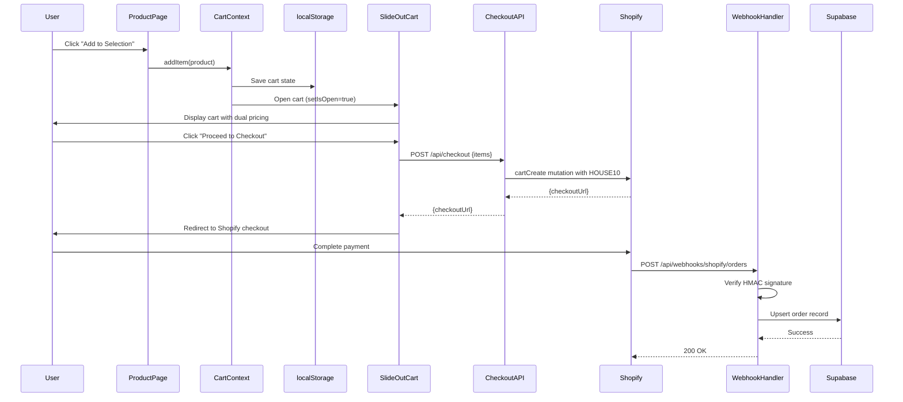

# Design Document: Phase 2 Revenue Mechanics

## Overview

Phase 2 Revenue Mechanics implements a complete e-commerce transaction pipeline for Charmed & Dark, integrating four major systems: AI-powered product narrative generation, client-side cart management with localStorage persistence, Shopify checkout with automatic discount application, and secure webhook-based order verification.

The system follows a brutalist design aesthetic with sharp edges (0px border radius), minimal gold accents (#B89C6D), and dual pricing display (public vs House member pricing). The architecture prioritizes security through HMAC signature verification, performance through variant ID caching, and user experience through automatic cart persistence and discount application.

### Key Design Decisions

1. **React Context for Cart State**: Chosen over Redux or other state management to minimize dependencies and leverage React's built-in capabilities. Cart state is ephemeral (session-based) with localStorage persistence for continuity across page reloads.

2. **Shopify Storefront API**: Selected over Admin API to enable client-side checkout redirects while maintaining security boundaries. The Storefront API provides cart creation and checkout URL generation without exposing admin-level operations.

3. **HMAC Webhook Verification**: Implements crypto.timingSafeEqual for constant-time comparison to prevent timing attacks. This is critical for webhook security as it prevents attackers from inferring signature validity through response timing.

4. **Variant ID Caching**: Stores shopify_variant_id in the products table during sync to eliminate per-checkout API lookups. This reduces checkout latency and Shopify API rate limit consumption.

5. **Claude Sonnet 4 for Lore Generation**: Uses the latest Claude model with explicit voice rules to maintain brand consistency. The 80-150 word constraint ensures descriptions are atmospheric without overwhelming product pages.

## Architecture

### System Components

```mermaid
graph TB
    subgraph "Client Layer"
        PDP[Product Detail Page]
        Cart[SlideOutCart Component]
        AddBtn[AddToCartButton]
        CartCtx[CartContext Provider]
    end
    
    subgraph "API Layer"
        CheckoutAPI[/api/checkout]
        WebhookAPI[/api/webhooks/shopify/orders]
        SyncAPI[/api/admin/sync-products]
    end
    
    subgraph "External Services"
        Claude[Claude API]
        ShopifyGQL[Shopify Storefront API]
        ShopifyWebhook[Shopify Webhooks]
    end
    
    subgraph "Data Layer"
        Supabase[(Supabase)]
        LocalStorage[Browser localStorage]
    end
    
    PDP --> AddBtn
    AddBtn --> CartCtx
    CartCtx --> Cart
    CartCtx --> LocalStorage
    Cart --> CheckoutAPI
    CheckoutAPI --> ShopifyGQL
    ShopifyGQL --> |checkoutUrl| Cart
    ShopifyWebhook --> WebhookAPI
    WebhookAPI --> Supabase
    SyncAPI --> ShopifyGQL
    SyncAPI --> Claude
    SyncAPI --> Supabase
    
    style Cart fill:#1a1a1a,stroke:#B89C6D
    style CheckoutAPI fill:#1a1a1a,stroke:#B89C6D
    style WebhookAPI fill:#1a1a1a,stroke:#B89C6D
```

### Data Flow: Complete Purchase Journey



### Security Architecture

```mermaid
graph LR
    subgraph "Webhook Security"
        ShopifyHook[Shopify Webhook] --> |HMAC Header| Handler[Webhook Handler]
        Handler --> Verify[crypto.createHmac]
        Verify --> Compare[timingSafeEqual]
        Compare --> |Valid| Process[Process Order]
        Compare --> |Invalid| Reject[401 Unauthorized]
    end
    
    subgraph "API Security"
        SyncReq[Sync Request] --> Auth[Bearer Token Check]
        Auth --> |Valid| Sync[Sync Products]
        Auth --> |Invalid| Deny[401 Unauthorized]
    end
    
    style Verify fill:#1a1a1a,stroke:#B89C6D
    style Compare fill:#1a1a1a,stroke:#B89C6D
```



## Components and Interfaces

### CartContext Provider

**Purpose**: Manages global cart state with localStorage persistence and provides cart operations to all components.

**State Shape**:
```javascript
{
  items: [
    {
      slug: string,
      name: string,
      price: number,
      originalPrice: number,
      imageUrl: string | null,
      quantity: number,
      shopifyVariantId: string | null
    }
  ],
  isOpen: boolean,
  itemCount: number,
  subtotal: number,
  sanctuarySubtotal: number
}
```

**Public Methods**:
- `addItem(product, quantity = 1)`: Adds product to cart or increments quantity if exists
- `removeItem(slug)`: Removes product from cart by slug
- `updateQuantity(slug, quantity)`: Updates quantity (removes if quantity <= 0)
- `clearCart()`: Removes all items from cart
- `setIsOpen(boolean)`: Controls cart panel visibility

**localStorage Key**: `"charmed-dark-cart"`

**Persistence Strategy**: 
- Load from localStorage on mount (useEffect with empty deps)
- Save to localStorage on items change (useEffect with items deps)
- Graceful error handling for localStorage failures (quota exceeded, disabled)

### SlideOutCart Component

**Purpose**: Brutalist-styled slide-out panel displaying cart contents with dual pricing and checkout button.

**Visual Specifications**:
- Width: `max-w-md` (full width on mobile)
- Position: Fixed right, full height
- Border radius: 0px (brutalist)
- Border: 1px solid #27272a (zinc-800)
- Backdrop: rgba(0,0,0,0.6)
- Gold accent: #B89C6D for House pricing

**Interaction States**:
- Closed: Not rendered (conditional render)
- Open: Slide in from right with backdrop
- Checkout loading: Button disabled with "Opening Checkout..." text

**Pricing Display**:
```
Public Price:  $XXX.XX  (line-through, zinc-400)
House Price:   $XXX.XX  (gold #B89C6D, 10% off)
```

### AddToCartButton Component

**Purpose**: Reusable button for product pages that adds items to cart.

**Props Interface**:
```typescript
{
  product: {
    slug: string,
    name: string,
    price: number,
    salePrice?: number,
    imageUrls?: string[],
    shopifyVariantId?: string
  }
}
```

**Styling**: Brutalist button with 0px border radius, zinc-700 border, gold hover (#B89C6D)

### Checkout API Route

**Endpoint**: `POST /api/checkout`

**Request Body**:
```json
{
  "items": [
    {
      "slug": "gothic-candle-holder",
      "quantity": 2,
      "shopifyVariantId": "gid://shopify/ProductVariant/123456"
    }
  ]
}
```

**Response (Success)**:
```json
{
  "checkoutUrl": "https://charmedanddark.myshopify.com/cart/c/..."
}
```

**Response (Error)**:
```json
{
  "error": "No items in cart" | "No valid products found" | "Failed to create checkout",
  "details": [...] // Optional GraphQL errors
}
```

**Status Codes**:
- 200: Success with checkoutUrl
- 400: Invalid request (empty cart, no valid products)
- 500: Shopify API error or internal failure

**Shopify GraphQL Mutation**:
```graphql
mutation cartCreate($input: CartInput!) {
  cartCreate(input: $input) {
    cart {
      id
      checkoutUrl
    }
    userErrors {
      field
      message
    }
  }
}
```

**Variant ID Resolution**:
1. If `shopifyVariantId` provided: Use directly
2. If missing: Query Shopify by product handle (slug)
3. If lookup fails: Skip product and log error

**Discount Application**: HOUSE10 code included in `discountCodes` array during cart creation

### Webhook Handler Route

**Endpoint**: `POST /api/webhooks/shopify/orders`

**Security Flow**:
1. Extract raw request body (required for HMAC verification)
2. Extract `x-shopify-hmac-sha256` header
3. Compute HMAC: `crypto.createHmac('sha256', SHOPIFY_WEBHOOK_SECRET).update(rawBody).digest('base64')`
4. Compare using `crypto.timingSafeEqual(Buffer.from(hash), Buffer.from(hmacHeader))`
5. Reject with 401 if mismatch

**Order Data Extraction**:
```javascript
{
  shopify_order_id: String(order.id),
  shopify_order_number: String(order.order_number),
  email: order.email || order.contact_email,
  total_price: parseFloat(order.total_price),
  subtotal_price: parseFloat(order.subtotal_price),
  total_discount: parseFloat(order.total_discounts),
  currency: order.currency || 'USD',
  financial_status: order.financial_status,
  fulfillment_status: order.fulfillment_status,
  line_items: order.line_items.map(...),
  shipping_address: order.shipping_address,
  customer_email: order.customer?.email || order.email,
  customer_name: `${order.customer.first_name} ${order.customer.last_name}`,
  discount_codes: order.discount_codes,
  source: 'web'
}
```

**Database Operation**: Upsert to `orders` table with conflict resolution on `shopify_order_id`

### AI Narrative Engine

**Module**: `lib/ai/generate-lore.js`

**Function Signature**:
```javascript
async function generateProductLore(product: {
  name: string,
  category?: string,
  description?: string,
  price: number
}): Promise<string | null>
```

**Claude API Configuration**:
- Model: `claude-sonnet-4-20250514`
- Max tokens: 1024
- API version: `2023-06-01`

**System Prompt Rules**:
- Second person voice ("you")
- No exclamation marks
- Forbidden words: unique, stunning, amazing, perfect, beautiful
- 2-3 short paragraphs, 80-150 words total
- Gothic, intimate, deliberate tone
- Material and details woven into prose (no bullet lists)

**Error Handling**: Returns null on failure, logs error, allows sync to continue

### Sync Pipeline Enhancement

**Endpoint**: `POST /api/admin/sync-products`

**Authentication**: Bearer token check against `SYNC_API_SECRET`

**Enhanced transformShopifyProduct**:
```javascript
{
  // ... existing fields
  shopify_variant_id: shopifyProduct.variants.edges[0]?.node?.id || null
}
```

**Lore Generation Logic**:
1. Upsert product data (including shopify_variant_id)
2. Query existing product for lore field
3. If lore is null: Generate and update
4. If lore exists: Skip generation
5. Log failures but continue sync

**Sync Summary Response**:
```json
{
  "success": true,
  "total_shopify": 42,
  "synced": 42,
  "lore_generated": 15,
  "errors": 0,
  "error_details": [],
  "synced_at": "2025-01-15T10:30:00.000Z"
}
```

## Data Models

### Products Table (Enhanced)

```sql
CREATE TABLE products (
  id UUID PRIMARY KEY DEFAULT uuid_generate_v4(),
  shopify_id TEXT UNIQUE,
  shopify_variant_id TEXT,  -- NEW: Cached for checkout performance
  name TEXT NOT NULL,
  slug TEXT UNIQUE NOT NULL,
  handle TEXT UNIQUE,
  title TEXT,
  category TEXT,
  subcategory TEXT,
  description TEXT,
  lore TEXT,  -- AI-generated gothic narrative
  price NUMERIC(10,2) NOT NULL,
  sale_price NUMERIC(10,2),
  sku TEXT,
  qty INTEGER DEFAULT 0,
  stock_quantity INTEGER DEFAULT 0,
  hidden BOOLEAN DEFAULT false,
  image_urls TEXT[],
  image_url TEXT,
  tags TEXT[],
  featured BOOLEAN DEFAULT false,
  best_seller BOOLEAN DEFAULT false,
  collection TEXT,
  meta_title TEXT,
  meta_description TEXT,
  created_at TIMESTAMPTZ DEFAULT NOW(),
  updated_at TIMESTAMPTZ DEFAULT NOW()
);

CREATE INDEX idx_products_slug ON products(slug);
CREATE INDEX idx_products_handle ON products(handle);
CREATE INDEX idx_products_category ON products(category);
CREATE INDEX idx_products_shopify_variant_id ON products(shopify_variant_id);
```

**Key Fields**:
- `shopify_variant_id`: Global ID from Shopify GraphQL (e.g., `gid://shopify/ProductVariant/123456`)
- `lore`: AI-generated product narrative (80-150 words)
- `sale_price`: Current selling price (used for cart display)
- `price`: Original price (used for strikethrough display)

### Orders Table

```sql
CREATE TABLE orders (
  id UUID PRIMARY KEY DEFAULT uuid_generate_v4(),
  shopify_order_id TEXT UNIQUE NOT NULL,
  shopify_order_number TEXT,
  email TEXT,
  customer_email TEXT,
  customer_name TEXT,
  total_price NUMERIC(10,2) NOT NULL,
  subtotal_price NUMERIC(10,2),
  total_discount NUMERIC(10,2),
  currency TEXT DEFAULT 'USD',
  financial_status TEXT,
  fulfillment_status TEXT,
  line_items JSONB,
  shipping_address JSONB,
  discount_codes JSONB,
  source TEXT DEFAULT 'web',
  created_at TIMESTAMPTZ DEFAULT NOW(),
  updated_at TIMESTAMPTZ DEFAULT NOW()
);

CREATE INDEX idx_orders_shopify_order_id ON orders(shopify_order_id);
CREATE INDEX idx_orders_email ON orders(email);
CREATE INDEX idx_orders_created_at ON orders(created_at DESC);
```

**JSONB Structures**:

`line_items`:
```json
[
  {
    "product_id": 123456,
    "title": "Gothic Candle Holder",
    "quantity": 2,
    "price": "45.00",
    "sku": "GCH-001"
  }
]
```

`shipping_address`:
```json
{
  "first_name": "Jane",
  "last_name": "Doe",
  "address1": "123 Dark St",
  "city": "Salem",
  "province": "MA",
  "country": "US",
  "zip": "01970"
}
```

`discount_codes`:
```json
[
  {
    "code": "HOUSE10",
    "amount": "4.50",
    "type": "percentage"
  }
]
```

### Environment Variables

**Required for Production**:

```bash
# AI Lore Generation
ANTHROPIC_API_KEY=sk-ant-...

# Shopify Integration
SHOPIFY_STORE_DOMAIN=charmedanddark.myshopify.com
SHOPIFY_STOREFRONT_ACCESS_TOKEN=shpat_...
SHOPIFY_WEBHOOK_SECRET=whsec_...
NEXT_PUBLIC_SHOPIFY_CHECKOUT_DOMAIN=charmedanddark.myshopify.com

# Supabase
NEXT_PUBLIC_SUPABASE_URL=https://xxx.supabase.co
NEXT_PUBLIC_SUPABASE_ANON_KEY=eyJ...
SUPABASE_SERVICE_ROLE_KEY=eyJ...

# Admin API
SYNC_API_SECRET=random-secure-token
```

**Security Notes**:
- `ANTHROPIC_API_KEY`: Server-side only, never exposed to client
- `SHOPIFY_WEBHOOK_SECRET`: Used for HMAC verification, must match Shopify webhook config
- `SUPABASE_SERVICE_ROLE_KEY`: Bypasses RLS, server-side only
- `SYNC_API_SECRET`: Simple bearer token for sync endpoint (replace with proper admin auth in production)


## Correctness Properties

*A property is a characteristic or behavior that should hold true across all valid executions of a system—essentially, a formal statement about what the system should do. Properties serve as the bridge between human-readable specifications and machine-verifiable correctness guarantees.*

### Property 1: Lore Generation Coverage

*For any* product in the sync pipeline, the AI Narrative Engine should attempt to generate lore using the Claude API.

**Validates: Requirements 1.1**

### Property 2: Lore Word Count Constraint

*For any* generated product lore, the word count should be between 80 and 150 words inclusive.

**Validates: Requirements 1.3**

### Property 3: No Exclamation Marks in Lore

*For any* generated product lore, the text should contain zero exclamation marks.

**Validates: Requirements 1.4**

### Property 4: Forbidden Words Exclusion

*For any* generated product lore, the text should not contain the words "unique", "stunning", "amazing", "perfect", or "beautiful" (case-insensitive).

**Validates: Requirements 1.5**

### Property 5: Lore Paragraph Structure

*For any* generated product lore, the text should be structured as 2 or 3 paragraphs (separated by double newlines).

**Validates: Requirements 1.6**

### Property 6: Lore Persistence

*For any* product where lore generation succeeds, the generated lore should be stored in the products table lore column.

**Validates: Requirements 1.7**

### Property 7: Sync Error Resilience

*For any* product where lore generation fails during sync, the sync pipeline should continue processing remaining products without terminating.

**Validates: Requirements 1.8**

### Property 8: Add to Cart Operation

*For any* product, when added to the cart, it should appear in the cart items array with quantity 1 (or increment existing quantity by 1 if already present).

**Validates: Requirements 2.1, 3.2**

### Property 9: Cart Auto-Open

*For any* product added to the cart, the cart panel should automatically open (isOpen becomes true).

**Validates: Requirements 2.2**

### Property 10: Cart localStorage Persistence

*For any* cart state, the items array should be persisted to localStorage under the key "charmed-dark-cart".

**Validates: Requirements 2.3**

### Property 11: Cart localStorage Round-Trip

*For any* cart state, saving to localStorage and then loading on page mount should restore the same cart items with identical slugs, quantities, and prices.

**Validates: Requirements 2.4**

### Property 12: Cart Item Display Completeness

*For any* cart item, the rendered output should include the product image, name, price, and quantity controls (plus/minus buttons).

**Validates: Requirements 2.5**

### Property 13: Quantity Update Operations

*For any* cart item, increasing quantity should add 1, and decreasing quantity should subtract 1 (or remove the item if quantity reaches 0).

**Validates: Requirements 2.6, 2.7, 2.8**

### Property 14: Remove Item Operation

*For any* cart item, clicking remove should result in that item no longer appearing in the cart items array.

**Validates: Requirements 2.9**

### Property 15: Clear Cart Operation

*For any* cart state with items, clicking clear should result in an empty cart (items.length === 0).

**Validates: Requirements 2.10**

### Property 16: Pricing Calculations

*For any* cart state, the public price (subtotal) should equal the sum of (item.price × item.quantity) for all items, and the house price (sanctuarySubtotal) should equal subtotal × 0.9.

**Validates: Requirements 2.11, 2.12**

### Property 17: Product Data Structure Completeness

*For any* product passed to AddToCartButton, the cart item should include slug, name, price, imageUrl, and shopifyVariantId fields.

**Validates: Requirements 3.6**

### Property 18: Variant ID Fallback Lookup

*For any* cart item without a shopifyVariantId, the Checkout API should perform a Shopify GraphQL lookup by product handle to retrieve the variant ID.

**Validates: Requirements 4.3**

### Property 19: Checkout URL Return

*For any* successful cart creation in Shopify, the Checkout API should return a response containing a checkoutUrl field.

**Validates: Requirements 4.5**

### Property 20: HMAC Signature Verification

*For any* incoming webhook request, the Webhook Handler should compute an HMAC signature using the raw request body and SHOPIFY_WEBHOOK_SECRET, then compare it to the x-shopify-hmac-sha256 header using crypto.timingSafeEqual.

**Validates: Requirements 6.1**

### Property 21: Invalid HMAC Rejection

*For any* webhook request where the computed HMAC does not match the header HMAC, the Webhook Handler should return status 401 and reject the request without processing.

**Validates: Requirements 6.2**

### Property 22: Valid HMAC Order Parsing

*For any* webhook request with a valid HMAC signature, the Webhook Handler should parse the request body as JSON to extract order data.

**Validates: Requirements 6.3**

### Property 23: Order Data Extraction Completeness

*For any* valid order webhook, the Webhook Handler should extract and structure shopify_order_id, shopify_order_number, email, total_price, currency, financial_status, line_items (as JSONB), and shipping_address (as JSONB).

**Validates: Requirements 6.4, 6.5, 6.6**

### Property 24: Order Storage Upsert

*For any* valid order webhook, the Webhook Handler should upsert the order record to the orders table using shopify_order_id as the conflict resolution key.

**Validates: Requirements 6.7**

### Property 25: Successful Storage Response

*For any* order that is successfully stored in the database, the Webhook Handler should return status 200 with a success message.

**Validates: Requirements 6.8**

### Property 26: Failed Storage Response

*For any* order where database storage fails, the Webhook Handler should return status 500 with an error message.

**Validates: Requirements 6.9**

### Property 27: End-to-End Data Preservation

*For any* product added to cart and checked out, the product data (name, price, quantity) should be preserved through the cart → checkout → webhook → database pipeline.

**Validates: Requirements 8.4**

### Property 28: Discount Application Verification

*For any* cart checkout, the HOUSE10 discount code should be included in the Shopify cart creation request, resulting in a 10% reduction in the final checkout price.

**Validates: Requirements 8.5**

### Property 29: Product Transform Includes Variant ID

*For any* product row from the database, the transformProduct function should include the shopifyVariantId field in the returned product object.

**Validates: Requirements 9.4**

### Property 30: Direct Variant ID Usage

*For any* cart item with a shopifyVariantId, the Checkout API should use that ID directly in the Shopify cart creation mutation without performing an additional lookup.

**Validates: Requirements 9.5**

### Property 31: Missing Environment Variable Error Logging

*For any* required environment variable that is missing or undefined, the application should log a clear error message indicating which variable is missing.

**Validates: Requirements 10.7**

## Error Handling

### AI Lore Generation Errors

**Scenario**: Claude API returns 4xx or 5xx error
**Handling**: 
- Log error with product name and API response
- Set lore to null for that product
- Continue sync pipeline without terminating
- Include error in sync summary response

**Scenario**: Claude API timeout or network failure
**Handling**:
- Log error with product name
- Set lore to null for that product
- Continue sync pipeline
- Retry logic not implemented (manual re-sync required)

### Cart localStorage Errors

**Scenario**: localStorage quota exceeded
**Handling**:
- Log error to console
- Cart continues to function in memory for current session
- User loses cart on page reload

**Scenario**: localStorage disabled (private browsing)
**Handling**:
- Catch exception in try/catch blocks
- Cart functions in memory only
- No error shown to user (graceful degradation)

### Checkout API Errors

**Scenario**: Empty cart submitted
**Handling**:
- Return 400 status with error message "No items in cart"
- Client displays alert to user

**Scenario**: All variant ID lookups fail
**Handling**:
- Return 400 status with error message "No valid products found"
- Client displays alert to user

**Scenario**: Shopify API returns userErrors
**Handling**:
- Log userErrors array to console
- Return 500 status with error details
- Client displays generic "Checkout temporarily unavailable" message

**Scenario**: Shopify API network failure
**Handling**:
- Catch exception in try/catch
- Return 500 status with error message
- Client displays generic error message

### Webhook Handler Errors

**Scenario**: Invalid HMAC signature
**Handling**:
- Log "Webhook HMAC verification failed" to console
- Return 401 status with error message "Unauthorized"
- Do not process order data

**Scenario**: Malformed JSON in request body
**Handling**:
- Catch JSON.parse exception
- Return 500 status with error message
- Log error to console

**Scenario**: Database upsert failure
**Handling**:
- Log Supabase error to console
- Return 500 status with error message "Failed to save order"
- Shopify will retry webhook (exponential backoff)

**Scenario**: Missing required order fields
**Handling**:
- Use null coalescing operators to provide defaults
- Store order with partial data
- Log warning if critical fields missing

### Environment Variable Errors

**Scenario**: Missing ANTHROPIC_API_KEY
**Handling**:
- Fetch to Claude API will fail with authentication error
- Lore generation fails for all products
- Sync continues with null lore values

**Scenario**: Missing SHOPIFY_WEBHOOK_SECRET
**Handling**:
- HMAC verification will fail for all webhooks
- All webhook requests rejected with 401
- Orders not stored in database

**Scenario**: Missing Shopify credentials
**Handling**:
- Checkout API returns 500 error
- Client displays error message
- User cannot complete checkout

## Testing Strategy

### Dual Testing Approach

This feature requires both unit tests and property-based tests to ensure comprehensive coverage:

**Unit Tests**: Focus on specific examples, edge cases, and integration points
- Empty cart display message
- Zero quantity item removal
- Invalid HMAC rejection with specific test signature
- Missing environment variable error messages
- Shopify API error response handling
- localStorage quota exceeded scenario

**Property-Based Tests**: Verify universal properties across randomized inputs
- Cart operations with random products and quantities
- Pricing calculations with random cart states
- Lore generation constraints with random product data
- HMAC verification with random payloads
- Order data extraction with random Shopify order structures

### Property-Based Testing Configuration

**Library Selection**: 
- JavaScript: `fast-check` (recommended for Next.js projects)
- Alternative: `jsverify` (older but stable)

**Test Configuration**:
- Minimum 100 iterations per property test (due to randomization)
- Each test must reference its design document property in a comment
- Tag format: `// Feature: phase2-revenue-mechanics, Property {number}: {property_text}`

**Example Property Test Structure**:
```javascript
// Feature: phase2-revenue-mechanics, Property 16: Pricing Calculations
test('cart pricing calculations are correct for any cart state', () => {
  fc.assert(
    fc.property(
      fc.array(cartItemArbitrary, { minLength: 1, maxLength: 10 }),
      (items) => {
        const subtotal = items.reduce((sum, item) => sum + (item.price * item.quantity), 0);
        const sanctuarySubtotal = subtotal * 0.9;
        
        expect(calculateSubtotal(items)).toBeCloseTo(subtotal, 2);
        expect(calculateSanctuarySubtotal(items)).toBeCloseTo(sanctuarySubtotal, 2);
      }
    ),
    { numRuns: 100 }
  );
});
```

### Test Organization

**Unit Tests**:
- `__tests__/components/SlideOutCart.test.js`: Cart UI behavior
- `__tests__/components/AddToCartButton.test.js`: Button integration
- `__tests__/context/CartContext.test.js`: Cart state management
- `__tests__/api/checkout.test.js`: Checkout API logic
- `__tests__/api/webhooks/shopify/orders.test.js`: Webhook handler
- `__tests__/lib/ai/generate-lore.test.js`: Lore generation

**Property-Based Tests**:
- `__tests__/properties/cart-operations.property.test.js`: Properties 8-17
- `__tests__/properties/pricing.property.test.js`: Property 16
- `__tests__/properties/lore-generation.property.test.js`: Properties 2-5
- `__tests__/properties/webhook-security.property.test.js`: Properties 20-23
- `__tests__/properties/data-preservation.property.test.js`: Property 27

### Integration Testing

**End-to-End Flow Test**:
1. Add product to cart (verify localStorage)
2. Mock Shopify API responses
3. Trigger checkout (verify API call with HOUSE10)
4. Simulate webhook with valid HMAC
5. Verify order in database
6. Validate data preservation throughout pipeline

**Manual Testing Checklist**:
- [ ] Add multiple products to cart
- [ ] Verify dual pricing display (public vs house)
- [ ] Update quantities with +/- buttons
- [ ] Remove individual items
- [ ] Clear entire cart
- [ ] Reload page and verify cart persistence
- [ ] Complete checkout on Shopify staging
- [ ] Verify webhook received and order stored
- [ ] Test with HOUSE10 discount applied
- [ ] Verify brutalist styling (0px border radius, gold accents)

### Security Testing

**HMAC Verification Tests**:
- Valid signature acceptance
- Invalid signature rejection
- Timing attack resistance (verify timingSafeEqual usage)
- Missing header handling
- Malformed header handling

**Environment Variable Tests**:
- Missing ANTHROPIC_API_KEY
- Missing SHOPIFY_WEBHOOK_SECRET
- Missing Shopify credentials
- Invalid/malformed credentials

### Performance Considerations

**Checkout Optimization**:
- Variant ID caching eliminates per-checkout lookups
- Expected latency: <500ms for cart creation
- Shopify API rate limit: 2 requests per second (Storefront API)

**Webhook Processing**:
- HMAC verification: <10ms
- Database upsert: <50ms
- Total webhook processing: <100ms target

**Lore Generation**:
- Claude API latency: 2-5 seconds per product
- Sync pipeline: Sequential processing (no parallelization)
- Expected sync time: 2-5 minutes for 50 products

### Test Data Generators

**Cart Item Arbitrary** (for property tests):
```javascript
const cartItemArbitrary = fc.record({
  slug: fc.string({ minLength: 5, maxLength: 50 }),
  name: fc.string({ minLength: 10, maxLength: 100 }),
  price: fc.float({ min: 1, max: 500, noNaN: true }),
  quantity: fc.integer({ min: 1, max: 10 }),
  imageUrl: fc.option(fc.webUrl(), { nil: null }),
  shopifyVariantId: fc.option(fc.string(), { nil: null })
});
```

**Shopify Order Arbitrary**:
```javascript
const shopifyOrderArbitrary = fc.record({
  id: fc.bigInt({ min: 1000000n, max: 9999999999n }),
  order_number: fc.integer({ min: 1000, max: 9999 }),
  email: fc.emailAddress(),
  total_price: fc.float({ min: 10, max: 1000, noNaN: true }).map(n => n.toFixed(2)),
  currency: fc.constantFrom('USD', 'EUR', 'GBP'),
  financial_status: fc.constantFrom('paid', 'pending', 'refunded'),
  line_items: fc.array(lineItemArbitrary, { minLength: 1, maxLength: 5 }),
  shipping_address: shippingAddressArbitrary
});
```

---

**Design Document Status**: Complete and ready for review

**Next Steps**:
1. User review and approval of design
2. Proceed to task creation phase
3. Implementation following design specifications
4. Property-based test implementation with fast-check
5. Integration testing and manual QA
6. Production deployment with environment variable configuration
